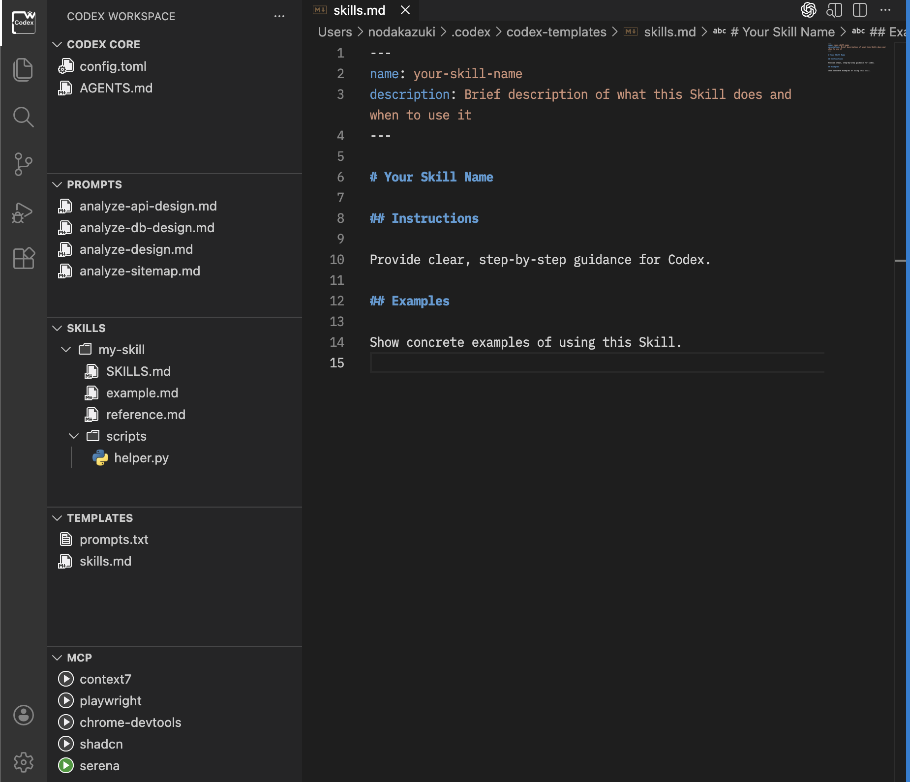

# Codex Workspace

Explore and manage your .codex workspace (config.toml, AGENTS.md, prompts, skills, templates, mcp) in VS Code.

## Features

- Dedicated explorers for Prompts, Skills, Templates, Agents, MCP, and Codex Core
- Create, rename, and delete files or folders under each root
- Open files in the editor with a single click
- Open each root folder in the OS file explorer
- Bidirectional sync between Codex Core/Prompts/Skills/Templates/Agents and configured folders
- Sync respects latest modified timestamps and excludes hidden files
- Enable/disable agents from context menu by adding/removing `[agents.<agent>]` in `config.toml`
- Toggle MCP servers on or off from the MCP Explorer
- Open Codex CLI conversation history in an editor WebView from Codex Core or Command Palette
- View conversation history in a searchable 2-pane layout
- Browse by date and open any conversation from the left list
- Preview messages on the right and copy user/assistant text when needed

>**IMPORTANT:** We parse sessions from $CODEX_HOME/sessions/.../rollout-*.jsonl and extract the fields to display, so if the current log format changes, the conversation history may no longer be displayed.

## Views

### CODEX CORE

Quick access to `config.toml` and `AGENTS.md`, plus shortcuts to open the `.codex` folder, launch the history view, and bidirectionally sync with a configured folder.

### PROMPTS EXPLORE

Manage prompt files under `~/.codex/prompts`, and bidirectionally sync them with a configured folder.

### SKILLS EXPLORE

Manage skill files under `~/.codex/skills`, and bidirectionally sync them with a configured folder.

### TEMPLATE EXPLORE

Manage template files under `~/.codex/codex-templates`, including template selection on file creation and bidirectional sync with a configured folder.

### AGENT EXPLORE

Manage agent files under `~/.codex/agents` (`*.toml`), create agents with optional template application, and enable/disable agents from the context menu.
Use the Agent view sync button to bidirectionally sync `~/.codex/agents` with a configured folder.

### MCP EXPLORE

View MCP servers from `config.toml` and toggle them on or off.

### HISTORY VIEW (EDITOR WEBVIEW)

Open Codex CLI sessions from `$CODEX_HOME/sessions/.../rollout-*.jsonl` in an editor WebView with a 2-pane layout:
- Top pane: search box + clear button
- Bottom left: day folders (`yyyy/mm/dd`) and conversation cards
- Bottom right: markdown-rendered task preview
  - User message and assistant response
  - Optional reasoning blocks (collapsible)
  - Copy buttons for user/assistant text
- Search: type a keyword to narrow the left list, and use clear to reset

## USAGE

1. Ensure `~/.codex` exists.
2. Open **Codex Workspace** from the Activity Bar.
3. Use the view title buttons to add files/folders, open the root folder, or sync with a configured folder.
4. Click a file to open it in the editor.
5. Open conversation history from the Codex Core history button or from the Command Palette command.

## Settings

| Key | Type | Default | Description |
| --- | --- | --- | --- |
| `codex-workspace.codexFolder` | string | `""` | Sync destination for Codex Core (`config.toml`, `AGENTS.md`) |
| `codex-workspace.promptsFolder` | string | `""` | Sync destination for Prompts |
| `codex-workspace.skillsFolder` | string | `""` | Sync destination for Skills |
| `codex-workspace.templatesFolder` | string | `""` | Sync destination for Templates |
| `codex-workspace.agentFolder` | string | `""` | Sync destination for Agents |
| `codex-workspace.maxHistoryCount` | number | `100` | History list max count. Applied when explicitly configured; otherwise all tasks are shown. |
| `codex-workspace.incrudeReasoningMessage` | boolean | `false` | Include reasoning messages in history preview |

## Privacy/Telemetry

This extension does not send any usage data (telemetry).

## License

MIT
