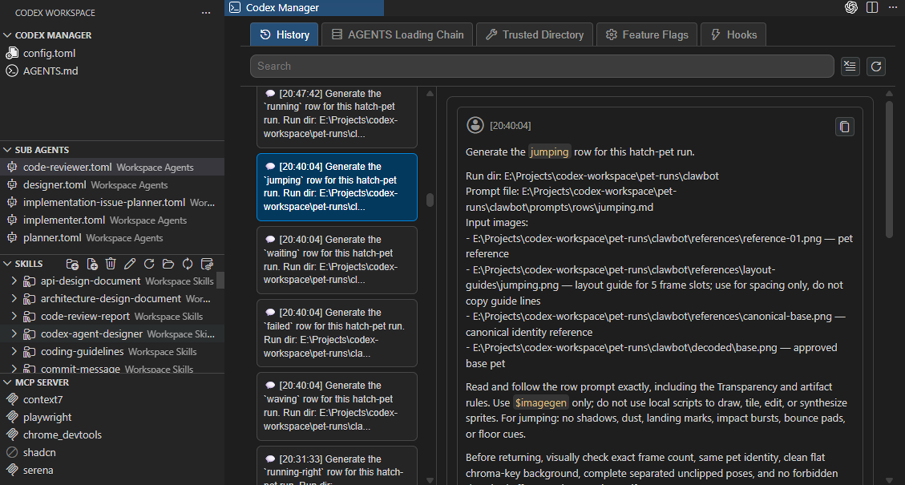
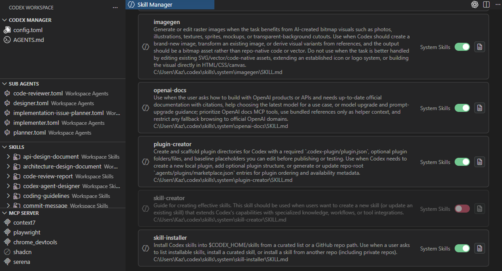
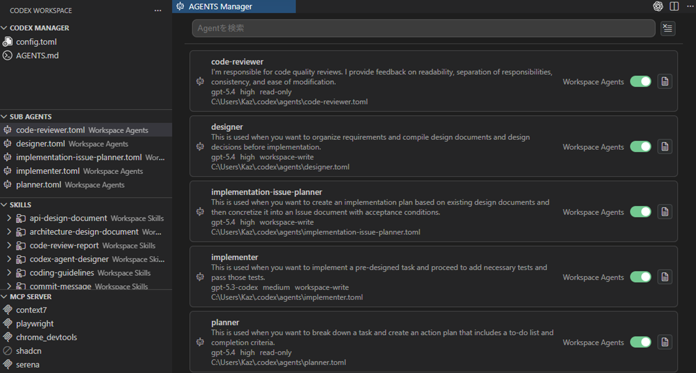
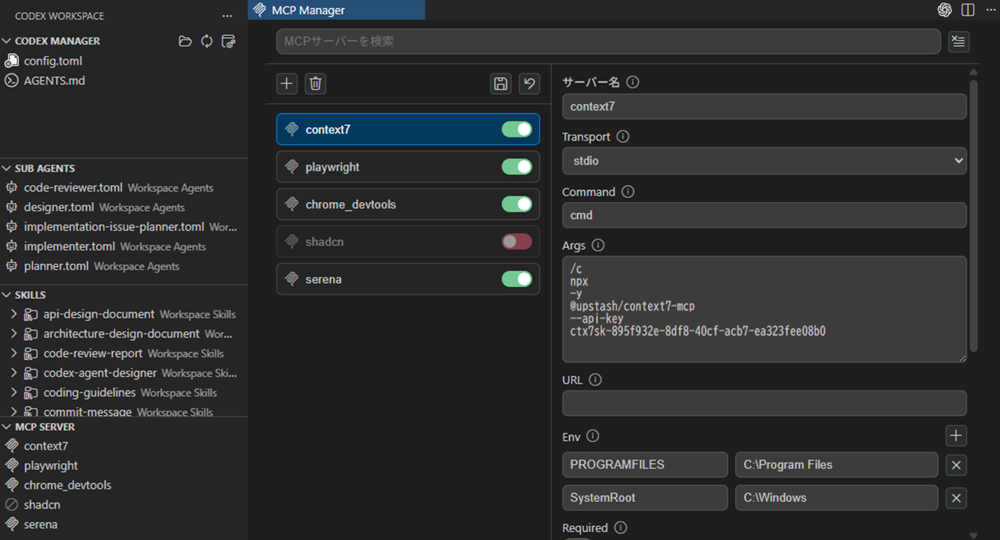

# Codex Workspace

Codex Workspace is a VS Code extension that brings scattered Codex configuration and operational assets into one place, so you can manage them without getting lost. It lets you work with everything from `config.toml` and `AGENTS.md` to Sub Agents, Skills, Commands, Templates, MCP servers, conversation history, Feature Flags, and Hooks diagnostics—all in a single, consistent workflow. Spend less time hunting for “where that thing lives,” and more time getting work done.

## Quick Start

1. Make sure the Codex home directory (usually `~/.codex`) exists.
2. Open **Codex Workspace** from the VS Code Activity Bar.
3. From each Explore title bar, you can:
   - Add files/folders
   - Open the target folder
   - Refresh
   - Sync
   - Open the Manager View
4. Open **Codex Manager** from the Core view or the Command Palette, then check:
   - History
   - AGENTS diagnostics
   - Trusted Directory
   - Feature Flags
   - Hooks

## Key Features

- Dedicated Explore views for `Codex Manager`, `Sub Agents`, `Skills`, `Commands`, `MCP Server`, and `Templates`
- One-click open for `config.toml`, `AGENTS.md`, `AGENTS.override.md`, prompts, skills, templates, and agent definition files
- Add, rename, and delete files/folders directly from supported Explore views
- Two-way sync between external folders and Core, Commands, Skills, Templates, and Sub Agents
- Unified Skills list across Project / Workspace / User / System
- Unified Sub Agents list across Project / Workspace / User
- Dedicated Manager Views for Skills, Sub Agents, and MCP Server
- `Codex Manager` that brings together conversation history, the AGENTS loading chain, Trusted Directory, Feature Flags, and Hooks

> **Important:** Conversation history is displayed by parsing `$CODEX_HOME/sessions/.../rollout-*.jsonl`. If Codex changes its log format, the History tab may stop working.

## Views

### Codex Manager

From the Core Explore view, you can access:

- `config.toml`
- `AGENTS.md`
- `AGENTS.override.md`
- Open the `.codex` folder
- Open `Codex Manager`
- Core sync with `codex-workspace.codexFolder`

`Codex Manager` opens as an editor Webview and includes the following tabs:

- `History`
  - Searchable conversation history
  - Independent scrolling for list and detail panes
  - Copy user / assistant text
  - Optional reasoning display (depending on settings)
- `AGENTS Loading Chain`
  - Diagnostics for the currently effective AGENTS-related files
  - Inspect ignored candidates, issues, and detailed candidates
  - Show the baseline workspace
- `Trusted Directory`
  - List trusted projects from `config.toml`
  - Add and remove trusted directories
- `Feature Flags`
  - View default, effective, and configured values for major Codex feature flags
  - Toggle supported flags ON/OFF
- `Hooks`
  - Diagnostics for user / project hook sources
  - Show project hooks as enabled/disabled based on trusted status
  - Create and open `hooks.json` / `config.toml`

### Commands

Manage files under `~/.codex/prompts` and sync them with `codex-workspace.promptsFolder`.

This Explore view is kept for compatibility. Newer “Manager-style” features (like Skills, Sub Agents, and MCP) are not added here.

### Skills

Manage Skills from multiple storage locations in a single Explore view:

- `Project Skills`: Prefer `project/.agents/skills`; fall back to `project/.codex/skills` if not present
- `Workspace Skills`: `~/.codex/skills`
- `User Skills`: `~/.agents/skills`
- `System Skills`: `~/.codex/skills/.system`

New Project Skills are always created in `project/.agents/skills`.  
When adding from the root, you can choose Project / Workspace / User.  
`System Skills` are shown as read-only.  
In `Skill Manager`, you can search, open, and toggle enable/disable.

### Sub Agents

Manage Sub Agents from multiple storage locations:

- `Project Agents`: Prefer `project/.codex/agents`; fall back to `project/.agents/agents` if not present
- `Workspace Agents`: `~/.codex/agents`
- `User Agents`: `~/.codex/agents`

New Project Agents are always created in `project/.codex/agents`.  
`AGENTS Manager` lets you search and manage enable/disable state.  
You can identify enabled/disabled state from the Explore icons.

### MCP Server

`MCP Server` keeps quick ON/OFF controls in the Explore view and also provides a dedicated `MCP Manager`.

In `MCP Manager`, you can:

- Search
- Add, edit, and delete server definitions
- Toggle enable/disable
- Edit key fields for `stdio` / `http` transports
- Edit and validate `env` key-value pairs
- Hide companion `.env` entries from the list, while deleting them together when deleting the parent server

### Templates

Manage templates under `~/.codex/codex-templates`. Supports template selection when creating files and sync with `codex-workspace.templatesFolder`.

## Commands

| Command | Description |
| --- | --- |
| `Codex Workspace: Open Codex Manager` | Opens the `Codex Manager` Webview |
| `Codex Workspace: Open Skill Manager` | Opens the `Skill Manager` Webview |
| `Codex Workspace: Open AGENTS Manager` | Opens the `AGENTS Manager` Webview |
| `Codex Workspace: Open MCP Manager` | Opens the `MCP Manager` Webview |
| `Codex Workspace: Organize config.toml` | Groups managed `config.toml` sections and creates `~/.codex/.codex-workspace/config.toml.bk` before rewriting |
| `Codex Workspace: Open .codex Folder` | Opens the `.codex` folder in the OS file explorer |

## Settings

| Key | Type | Default | Description |
| --- | --- | --- | --- |
| `codex-workspace.codexFolder` | string | `""` | Sync target for Core files such as `config.toml`, `AGENTS.md`, and `AGENTS.override.md` |
| `codex-workspace.promptsFolder` | string | `""` | Sync target for `Commands` |
| `codex-workspace.skillsFolder` | string | `""` | Sync target for Workspace Skills (`~/.codex/skills`) |
| `codex-workspace.templatesFolder` | string | `""` | Sync target for `Templates` |
| `codex-workspace.agentFolder` | string | `""` | Sync target for Sub Agents |
| `codex-workspace.maxHistoryCount` | number | `100` | Maximum number of history items to show when explicitly set. If unset, all detected history items are shown. |
| `codex-workspace.incrudeReasoningMessage` | boolean | `false` | Include reasoning messages in the history preview. The key name is preserved for backward compatibility. |

## License

MIT
