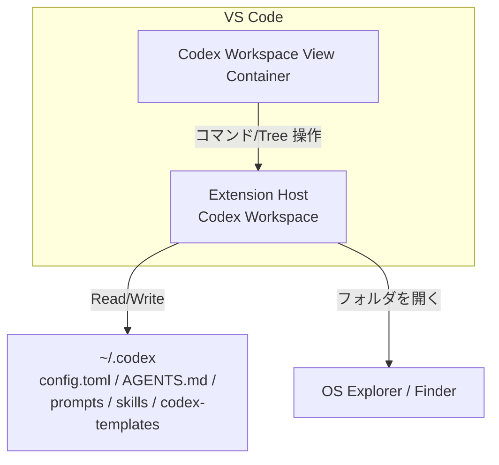

# 📘Codex Workspace 計書書

## 1. 🏷️システム概要

- **アプリ名**：`Codex Workspace`
- **目的**：Codex の `~/.codex` 配下にある設定・プロンプト・スキル・テンプレート・MCP 設定を VS Code 内で一元的に閲覧・編集できるようにする
- **対象ユーザー**：`~/.codex` の設定や各種ファイルを日常的に編集する Codex 利用者

## 2. 🧰技術スタック

| 階層         | 技術・ライブラリ                                |
| ---------- | --------------------------------------- |
| 言語         | TypeScript                               |
| 実行基盤       | Node.js                                  |
| 拡張API       | VS Code Extension API                    |
| 設定パース     | TOML パーサ（例：`toml`）                     |
| 多言語対応     | `vscode-nls`                              |
| テスト        | Mocha + VS Code Test（`@vscode/test-*`）  |

## 3. 🗂️プロジェクト構造

```txt
codex-workspace/
├── src/
│   ├── extension.ts           # エントリポイント
│   ├── views/                 # 各 Explorer の TreeDataProvider
│   ├── services/              # ファイル操作・MCP 切替・利用可否判定
│   ├── models/                # データモデル（TreeItem/MCP 等）
│   └── i18n/                  # 日本語/英語メッセージ定義
├── images/                    # アイコン類
├── docs/
└── package.json
```

## 4.🧩機能設計

- **共通（利用可否判定）**
  - 入力：`~/.codex` と `config.toml` の存在、`config.toml` の読み取り結果
  - 処理：存在チェックと TOML パース
  - 出力：利用可否ステータス、不可時は理由表示（`? Codex Workspace を開けません: <理由>`）
  - 検索条件：なし
  - ソート：なし
  - バリデーション：`config.toml` が TOML として parse 可能であること

- **共通（対象選択必須）**
  - 入力：Tree 上の選択状態
  - 処理：対象未選択なら処理を中断
  - 出力：`showInformationMessage("操作する対象を選択してください。")`（英語環境では英語）
  - 検索条件：なし
  - ソート：なし
  - バリデーション：対象選択の有無

- **Prompts / Skills / Templates Explorer（閲覧・追加・編集・削除・リネーム）**
  - 入力：対象選択、入力名、（テンプレート適用時は）テンプレート選択
  - 処理：ルートフォルダ自動作成、ファイル/フォルダ作成、編集はファイルのみ、削除時は確認、リネーム規則適用
  - 出力：Tree 更新、ファイルはエディタで開く
  - 検索条件：なし
  - ソート：VS Code 標準の表示順（ファイルシステムに準拠）
  - バリデーション：
    - ルートフォルダ（`prompts/skills/codex-templates`）はリネーム不可
    - 禁止文字は `_` に置換
    - 拡張子なしは `.md` を付与
    - 命名重複時は `_1`, `_2` で回避

- **テンプレート機能**
  - 入力：テンプレート選択（`.codex/codex-templates` 配下のファイルのみ）
  - 処理：テンプレート内容を新規作成ファイルへ適用
  - 出力：テンプレ内容の反映済みファイル
  - 検索条件：隠しファイル（`.` 始まり）は除外
  - ソート：VS Code 標準の表示順
  - バリデーション：テンプレートフォルダは固定（`.codex/codex-templates`）

- **MCP Explorer（一覧・トグル）**
  - 入力：`config.toml` の `[mcp_servers.<id>]` 定義、クリック操作
  - 処理：出現順で一覧化、`enabled` の反転、必要時は `enabled = false` をヘッダ直下へ挿入
  - 出力：スイッチ風表示の更新、完了通知
  - 検索条件：なし
  - ソート：`config.toml` の出現順
  - バリデーション：`enabled` 行はスペース有無を許容、末尾コメントは保持

- **フォルダを開く**
  - 入力：コマンド実行
  - 処理：`.codex` を OS の Explorer/Finder で開く
  - 出力：OS 側のフォルダ表示
  - 検索条件：なし
  - ソート：なし
  - バリデーション：対象パスの存在

- **Refresh**
  - 入力：Refresh 操作
  - 処理：Prompts / Skills / Templates / MCP / Core の全ビュー更新
  - 出力：最新状態の Tree
  - 検索条件：なし
  - ソート：なし
  - バリデーション：利用可否判定に従う

- **多言語対応（日本語・英語）**
  - 入力：VS Code 表示言語
  - 処理：`ja` の場合は日本語、それ以外は英語でラベル/メッセージを表示
  - 出力：ローカライズ済み UI
  - 検索条件：なし
  - ソート：なし
  - バリデーション：言語判定

## 5. 🗃️データモデル

| エンティティ            | 属性                  | 型       | 説明                                              | 制約 |
| ----------------- | ------------------- | ------- | ----------------------------------------------- | ---- |
| WorkspaceStatus   | isAvailable         | boolean | 利用可否                                           | false の場合は理由を必須 |
| WorkspaceStatus   | reason              | string  | 利用不可理由                                         | 利用不可時のみ |
| TreeNode          | id                  | string  | TreeItem の識別子                                   | 一意 |
| TreeNode          | path                | string  | 対象ファイル/フォルダの絶対パス                           | 実在パス |
| TreeNode          | kind                | string  | `prompts/skills/templates/core/mcp`               | 固定値 |
| TreeNode          | nodeType            | string  | `file` / `folder` / `command` / `mcpServer`       | 固定値 |
| McpServer         | id                  | string  | `[mcp_servers.<id>]` の `<id>`                    | 必須 |
| McpServer         | enabled             | boolean | MCP の有効/無効                                     | 省略時は true |
| McpServer         | enabledLineIndex    | number  | `enabled` 行の位置（未定義時は `null`）               | optional |
| TemplateCandidate | path                | string  | テンプレートファイルのパス                                 | 隠しファイル除外 |

## 6. 🖥️画面設計

- **View Container（Codex Workspace）**
  - Prompts Explorer
  - Skills Explorer
  - Template Explorer
  - MCP Explorer
  - Codex Core
  - UI 最上部の共通ボタンで追加/削除/リネーム/Refresh/.codex を開く
- **Prompts/Skills/Templates**
  - ルートに固定フォルダ（`prompts` / `skills` / `codex-templates`）
  - ファイルはエディタで開く
  - 操作：UI 最上部の共通ボタンで追加/削除/リネーム/Refresh（未選択時はメッセージ）
- **MCP Explorer**
  - サーバー一覧をスイッチ風 UI で表示
  - クリックで ON/OFF を切替
  - 成功時に再起動が必要な旨を通知
- **Codex Core**
  - `config.toml` / `AGENTS.md` のショートカット
- **利用不可時**
  - 各ビューに `? Codex Workspace を開けません: <理由>` を 1 件表示

## 7. 🗺️システム構成図



## 8.🔌外部インターフェース

- **ローカルファイルシステム**：`~/.codex` 配下の読み書き
- **OS Explorer/Finder**：`.codex` のフォルダ表示
- **VS Code Extension API**：TreeDataProvider、コマンド、UI メッセージ

## 9. 🧪テスト戦略

- **ユニットテスト**
  - `config.toml` の利用可否判定（存在/読取/パース）
  - `enabled` 行の検出・反転・コメント保持・未定義時の挿入
  - 禁止文字置換、拡張子付与、重複名回避
  - ルートフォルダのリネーム禁止
- **統合テスト**
  - 各 Explorer の Tree 表示（ルート固定、利用不可表示）
  - 追加/削除/リネーム操作の UI フロー（未選択時のメッセージ含む）
  - MCP トグル後の通知表示
- **ローカライズ確認**
  - `ja` と `en` のラベル/メッセージの切替

## 10. 🛡️非機能要件

- **ユーザビリティ**
  - UI 最上部の共通ボタン操作で InputBox を順に入力して各操作を実行できる
  - ボタンは codicon を使用し、`new-folder` / `new-file` / `trash` / `edit` / `refresh` / `folder-opened` を表示する
  - 未選択時にメッセージを表示し選択を促す
  - MCP の ON/OFF をスイッチ風 UI で直感的に切り替えられる
  - アイコンによりプロンプトファイル/フォルダと MCP の視認性を高める
  - ファイルを選択した場合は通常の Explorer と同様に開いて編集できる
- **ブランド要件**
  - 拡張名：Codex Workspace
  - タグライン：Explore and edit your .codex workspace (config.toml, AGENTS.md, prompts, skill, mcp) in VS Code.
  - Keywords：`codex`, `.codex`, `codex-cli`, `workspace`, `config`, `config.toml`, `toml`, `agent`, `AGENTS.md`, `prompts`, `prompt`, `skills`, `mcp`, `mcp server`, `explorer`, `tree view`, `editor`
- **保守性**
  - ビューごとに責務を分離し拡張しやすい構造とする
  - UI とファイル操作ロジックを分離しテスト容易性を確保する
