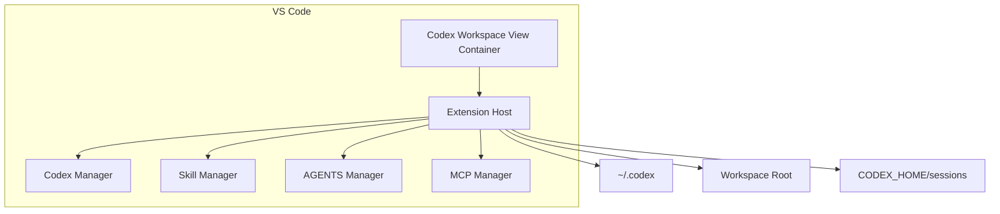

# 📘Codex Workspace 計書書

## 1. 🏷️システム概要

- **アプリ名**: `Codex Workspace`
- **種別**: VS Code 拡張
- **役割**: Codex の設定ファイル、Skills、Sub Agents、MCP Server、Templates、履歴・診断画面を VS Code 上で扱う
- **主要 UI**:
  - View Container 配下の 6 Tree View
  - `Codex Manager` / `Skill Manager` / `AGENTS Manager` / `MCP Manager` の 4 WebviewPanel

## 2. 🧰技術スタック

| 階層 | 技術・ライブラリ |
| --- | --- |
| 言語 | TypeScript |
| 実行基盤 | Node.js |
| 拡張 API | VS Code Extension API |
| ビルド | `esbuild` |
| Lint | `eslint` |
| 設定パース | `toml` |
| ローカライズ | `vscode-nls` |
| Webview アイコン | `@vscode/codicons` |
| テスト | Mocha + `@vscode/test-*` |

## 3. 🗂️プロジェクト構造

```txt
codex-workspace/
├── src/
│   ├── extension.ts
│   ├── commands/
│   │   ├── fileCommands.ts
│   │   └── agentCommands.ts
│   ├── services/
│   │   ├── workspaceStatus.ts
│   │   ├── historyService.ts
│   │   ├── historyPanel.ts
│   │   ├── skillConfigService.ts
│   │   ├── skillManagerPanel.ts
│   │   ├── agentConfigService.ts
│   │   ├── agentManagerService.ts
│   │   ├── agentManagerPanel.ts
│   │   ├── mcpService.ts
│   │   ├── mcpManagerService.ts
│   │   ├── mcpManagerPanel.ts
│   │   ├── coreDiagnosticsService.ts
│   │   ├── coreManagerConfigService.ts
│   │   ├── syncService.ts
│   │   └── configTomlOrganizerService.ts
│   ├── views/
│   │   ├── coreExplorerProvider.ts
│   │   ├── fileExplorerProvider.ts
│   │   ├── agentExplorerProvider.ts
│   │   └── mcpExplorerProvider.ts
│   ├── models/
│   │   └── treeItems.ts
│   └── test/
├── docs/
├── images/
└── package.json
```

## 4.🧩機能設計

- **拡張起動**
  - `extension.ts` で 6 つの Tree View を生成する
  - Tree の選択状態、展開状態、Webview manager のインスタンスを保持する
  - コマンド登録は `registerFileCommands()` と `registerAgentCommands()` に委譲する

- **Core Explorer**
  - `coreExplorerProvider.ts` が `config.toml`、`AGENTS.md`、存在時のみ `AGENTS.override.md` を生成する
  - `config.toml` が不正な場合、warning アイコンと tooltip で状態を見せる

- **Commands / Skills / Templates Explorer**
  - `fileExplorerProvider.ts` がフォルダとファイルを列挙する
  - 隠しファイルは除外する
  - ソートは「folder 優先 + 名前昇順」
  - Skills のみ複数 root をフラットに表示する
  - Skills の `SKILL.md` と skill root folder には有効/無効状態アイコンを付与する

- **Sub Agents Explorer**
  - `agentExplorerProvider.ts` が Project / Workspace ルートの `*.toml` を列挙する
  - アイコン状態は `config.toml` に `[agents.<id>]` があるかどうかで決まる
  - tooltip と description に location label を付与する

- **MCP Server Explorer**
  - `mcpExplorerProvider.ts` が `readMcpServers()` の結果を表示する
  - Tree item クリックで `codex-workspace.mcp.toggle` を実行する

- **ファイル操作**
  - `fileCommands.ts` が add / rename / delete を担当する
  - Skills では root 選択時に location picker を表示する
  - Skills の folder 作成時は `references` / `scripts` / `assets` の候補を先に出す
  - テンプレート候補は `templateService.ts` から取得する

- **Skill Manager**
  - `skillManagerPanel.ts` が単一 WebviewPanel を維持する
  - `skillConfigService.ts` が `SKILL.md` を再帰列挙し、frontmatter の `name` / `description` を読む
  - toggle は `[[skills.config]]` を追加または更新する

- **Sub Agents 操作**
  - `agentCommands.ts` が add / edit / delete / enable / disable を担当する
  - 作成後は `appendAgentConfigBlock()` で `config.toml` に block を追加する
  - 無効化時は block を `agents-disabled.json` に退避する
  - AGENTS Manager は `agentManagerService.ts` が一覧モデルを作る

- **MCP Manager**
  - `mcpManagerPanel.ts` が左 list / 右 form の Webview を提供する
  - `mcpManagerService.ts` が block 解析、バリデーション、保存、削除を行う
  - 保存時は管理対象キーのみ更新し、未管理キーは維持する

- **Codex Manager**
  - `historyPanel.ts` がタブ付き Core WebviewPanel を提供する
  - History タブは `historyService.ts` から `HistoryIndex` を構築する
  - AGENTS Loading Chain は `coreDiagnosticsService.ts` で推定診断を作る
  - Trusted Directory、Feature Flags、Hooks は `coreDiagnosticsService.ts` と `coreManagerConfigService.ts` を用いる

- **同期**
  - `syncService.ts` が Core / directory 単位の双方向同期を行う
  - 管理状態は `.codex-workspace/codex-sync.json` に保存する
  - Sub Agents 同期後は `agentSyncCleanupService.ts` で `config.toml` を補正する

- **`Organize config.toml`**
  - `configTomlOrganizerService.ts` が管理対象 cluster を再配置する
  - バックアップ先は `.codex-workspace/config.toml.bk`

## 5. 🗃️データモデル

| エンティティ | 属性 | 型 | 説明 |
| --- | --- | --- | --- |
| `WorkspaceStatus` | `isAvailable` / `reason` / `isConfigInvalid` | boolean / string | ビュー利用可否 |
| `SkillLocation` | `kind` / `label` / `rootPath` / `createPath` / `priority` | object | Skills 保存場所 |
| `SkillRecord` | `id` / `name` / `description` / `skillPath` / `enabled` | object | Skill Manager 行 |
| `AgentLocation` | `kind` / `label` / `rootPath` / `createPath` / `priority` | object | Sub Agents 保存場所 |
| `AgentManagerRecord` | `name` / `description` / `model` / `reasoningEffort` / `sandboxMode` / `agentPath` / `enabled` | object | AGENTS Manager 行 |
| `McpFormModel` | `id` / `transport` / `command` / `args` / `url` / `env` / `required` / `startupTimeoutSec` / `toolTimeoutSec` / `enabledTools` / `disabledTools` / `enabled` | object | MCP Manager 編集モデル |
| `HistoryTurnRecord` | `turnId` / `dateKey` / `userMessage` / `agentMessages` / `reasoningMessages` / `aiTimeline` | object | 会話履歴 1 タスク分 |
| `AgentsChainNode` | `status` / `kind` / `type` / `fileName` / `absolutePath` / `reason` | object | AGENTS Loading Chain 診断ノード |
| `TrustedDirectory` | `path` / `exists` / `reason` | object | Trusted Directory 表示モデル |
| `FeatureFlagRecord` | `key` / `enabled` / `configuredValue` / `defaultEnabled` / `maturity` / `description` | object | Feature Flags 表示モデル |
| `HookSourceRecord` | `id` / `layer` / `format` / `path` / `exists` / `active` / `entryCount` / `warning` | object | Hooks source 表示モデル |
| `HookEntryRecord` | `event` / `matcher` / `handlerType` / `command` / `timeout` / `statusMessage` / `active` / `supported` | object | Hooks entry 表示モデル |

## 6. 🖥️画面設計

- **View Container**
  - `Codex Manager`
  - `Sub Agents`
  - `Skills`
  - `Commands`
  - `MCP Server`
  - `Templates`

- **Core ビュー**
  - `config.toml`
  - `AGENTS.md`
  - `AGENTS.override.md` は存在時のみ
  - タイトルバー: open folder / open Codex Manager / sync

- **Commands ビュー**
  - `~/.codex/prompts` 配下を表示
  - タイトルバー: add file / delete / rename / refresh / open folder / sync

- **Skills ビュー**
  - Project / Workspace / User / System の各 root をまとめて表示
  - タイトルバー: add root folder / delete / rename / refresh / open folder / sync / Skill Manager
  - item context: add folder / add file

- **Templates ビュー**
  - `~/.codex/codex-templates` 配下を表示
  - タイトルバー: add root folder / add file / delete / rename / refresh / open folder / sync
  - item context: add folder / add file

- **Sub Agents ビュー**
  - Project / Workspace root の `*.toml` を表示
  - タイトルバー: add / edit / delete / refresh / open folder / sync / AGENTS Manager

- **MCP Server ビュー**
  - MCP サーバー一覧のみを表示
  - タイトルバー: refresh / MCP Manager

- **Skill Manager**
  - 上部: search / clear / refresh
  - 本体: list row
  - 行要素: icon / title / description / path / location / switch / open button

- **AGENTS Manager**
  - 上部: search / clear / refresh
  - 本体: list row
  - 行要素: icon / name / description / model / reasoningEffort / sandboxMode / path / location / switch / open button

- **MCP Manager**
  - 上部: search / clear / refresh
  - 左ペイン: server list, add / delete / save / cancel
  - 右ペイン: server detail form

- **Codex Manager**
  - タブ: History / AGENTS Loading Chain / Trusted Directory / Feature Flags / Hooks
  - History: 検索バー + 左一覧 + 右プレビュー
  - AGENTS Loading Chain: 左一覧 + 右詳細
  - Trusted Directory: add / remove / refresh
  - Feature Flags: list + toggle + refresh
  - Hooks: summary + source list + entry list

## 7. 🗺️システム構成図


```mermaid
flowchart TB
  subgraph VSCode[VS Code]
    VC[Codex Workspace View Container]
    EH[Extension Host]
    WV1[Codex Manager]
    WV2[Skill Manager]
    WV3[AGENTS Manager]
    WV4[MCP Manager]
  end

  CODEX[~/.codex]
  PROJECT[Workspace Root]
  SESSIONS[CODEX_HOME/sessions]

  VC --> EH
  EH --> CODEX
  EH --> PROJECT
  EH --> SESSIONS
  EH --> WV1
  EH --> WV2
  EH --> WV3
  EH --> WV4
```

## 8.🔌外部インターフェース

- **ファイルシステム**
  - `~/.codex`
  - `workspace/.agents/skills`
  - `workspace/.codex/skills`
  - `workspace/.codex/agents`
  - `workspace/.agents/agents`
  - `~/.agents/skills`
- **VS Code API**
  - Tree View
  - Command
  - Quick Pick / InputBox / Message
  - WebviewPanel
  - `vscode.open`
  - `vscode.env.openExternal`
- **設定**
  - `codex-workspace.*` の 7 設定キー
- **履歴入力**
  - `rollout-*.jsonl`

## 9. 🧪テスト戦略

- `src/test/` に単体テストを配置する。
- 主な確認対象:
  - `workspaceStatus.test.ts`: 利用可否判定
  - `viewTitleMenus.test.ts`: ビュータイトルメニュー寄与
  - `agentMenus.test.ts`: Agent メニュー寄与
  - `skillLocations.test.ts` / `agentLocations.test.ts`: 保存場所解決
  - `skillConfigService.test.ts` / `agentConfigService.test.ts`: `config.toml` 更新
  - `mcpService.test.ts` / `mcpManagerService.test.ts`: MCP 読み書き
  - `historyService.test.ts` / `historyPanel.test.ts`: 履歴抽出と Webview state
  - `coreDiagnosticsService.test.ts` / `coreManagerConfigService.test.ts`: Core 診断と設定更新
  - `syncService.test.ts` / `syncCommands.test.ts`: 双方向同期
  - `configTomlOrganizerService.test.ts`: `config.toml` 整理

## 10. 🛡️非機能要件

- **可用性**
  - `config.toml` が壊れていても Core ビューから修復導線を残す
- **保守性**
  - Explorer Provider と更新サービスを分離する
  - manager panel ごとに責務を分ける
- **一貫性**
  - Webview は VS Code テーマ色と codicon を使う
  - Skills / Agents / MCP の ON/OFF 表現を統一する
- **安全性**
  - 破壊操作は確認ダイアログを出す
  - User Skills 削除時のみ追加警告を出す
