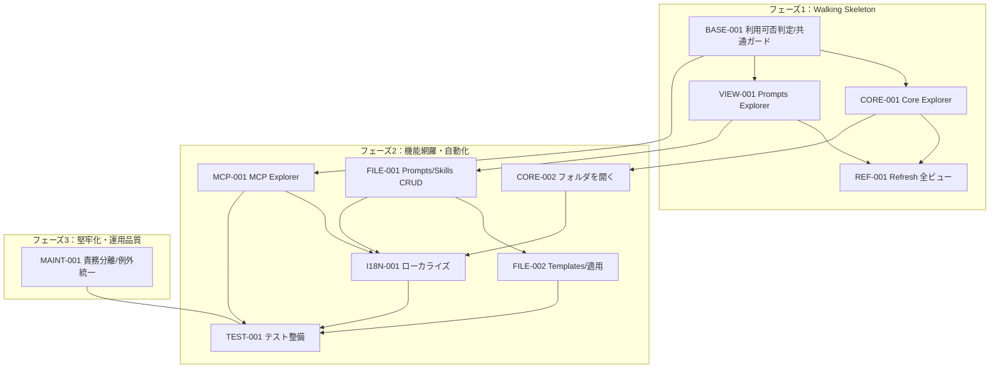

# 🧭Codex Workspace 実装計画

## 1. 🪜フェーズ定義（MVP優先）

| フェーズ                       | 目的                                   | 完了条件（重要）                                                                 | 代表的な成果物                                                                 |
| -------------------------- | ------------------------------------ | ------------------------------------------------------------------------ | ------------------------------------------------------------------------ |
| **フェーズ1：Walking Skeleton** | 最小のユーザー価値を最短で届ける                  | - View Container と Core/Prompts の基本操作が動作 - 利用可否判定とエラーノードが機能する | - View Container - Core/Prompts Explorer - 利用可否判定基盤 - Refresh |
| **フェーズ2：機能網羅・自動化**         | 機能要件を実装し、品質を最低保証                  | - 仕様の全機能が実装済み - 主要操作の自動テストが存在する                         | - CRUD 一式 - MCP トグル - テンプレート適用 - I18N - テスト |
| **フェーズ3：堅牢化・運用品質**         | 非機能要件（保守性/操作性）を満たし運用に耐える状態へ | - UI/ロジック分離が完了 - 例外/エラー時の挙動が統一されている                 | - サービス層の整理 - 例外ハンドリング統一 |

## 2. 🧾Issueアウトライン

### IssueID: `BASE-001`

- タイトル：`利用可否判定と共通ガード基盤を実装する`
- フェーズ：`Walking Skeleton`
- 要件：5.2, 5.3
- DependsOn：なし
- 規模：0.5〜1日
- 作業内容：
  - `~/.codex` / `config.toml` の存在・読取・TOML パースを判定するサービスを実装
  - 利用不可時は全ビューで共通エラーノードを 1 件だけ表示する
  - UI/イベント/保存先：各 Explorer のコマンド実行時に選択必須ガードを行い、未選択ならメッセージ表示（保存先なし）
- AC：
  - [ ] [機能] `~/.codex` または `config.toml` が欠落/読取不可/パース不可の場合、`? Codex Workspace を開けません: <理由>` が 1 件だけ表示される
  - [ ] [状態/エラー] 利用不可時は全コマンドが実行されず、状態が変化しない
  - [ ] [UI/UX] 対象未選択で操作するとメッセージが表示される
  - [ ] [テスト] 利用可否判定の主要ケース（存在/欠落/パース不可）をユニットテストで検証できる

### IssueID: `CORE-001`

- タイトル：`View Container と Codex Core Explorer を表示する`
- フェーズ：`Walking Skeleton`
- 要件：5.1
- DependsOn：`BASE-001`（利用可否判定の結果に応じた表示切替が必要）
- 規模：0.5〜1日
- 作業内容：
  - View Container に Prompts/Skills/Templates/MCP/Core を配置する
  - Codex Core に `config.toml` と `AGENTS.md` を表示しクリックで開く
  - UI/イベント/保存先：Core アイテムクリックでエディタを開く（保存先: `~/.codex/config.toml`, `~/.codex/AGENTS.md`）
- AC：
  - [ ] [UI/UX] アクティビティバーに Codex Workspace の View Container が表示される
  - [ ] [機能] Core の `config.toml` と `AGENTS.md` をクリックするとエディタで開ける
  - [ ] [状態/エラー] 利用不可時は Core でも共通エラーノードのみが表示される
  - [ ] [テスト] Core の表示/非表示切替が統合テストで確認できる

### IssueID: `VIEW-001`

- タイトル：`Prompts Explorer を表示しファイルを開ける`
- フェーズ：`Walking Skeleton`
- 要件：5.1, 5.5.3
- DependsOn：`BASE-001`（利用可否判定の結果を反映させるため）
- 規模：0.5〜1日
- 作業内容：
  - Prompts Explorer に固定ルート `prompts` を表示する
  - ファイル選択時にエディタで開く（フォルダは開かない）
  - UI/イベント/保存先：Tree クリックでファイルを開く（保存先: `~/.codex/prompts` 配下）
- AC：
  - [ ] [機能] Prompts Explorer のルートに `prompts` が表示される
  - [ ] [UI/UX] ファイルをクリックするとエディタで開く
  - [ ] [状態/エラー] フォルダ選択時は編集操作が発生しない
  - [ ] [テスト] Prompts の表示とファイルオープンが統合テストで検証できる

### IssueID: `REF-001`

- タイトル：`全ビュー Refresh を実装する`
- フェーズ：`Walking Skeleton`
- 要件：5.9
- DependsOn：`CORE-001`（複数ビューが存在するため）
- 規模：0.5日
- 作業内容：
  - 全 Explorer を更新する Refresh コマンドを実装
  - UI/イベント/保存先：UI 最上部の共通ボタンから Refresh を実行（保存先なし）
- AC：
  - [ ] [機能] Refresh 実行で Prompts/Skills/Templates/MCP/Core の全ビューが更新される
  - [ ] [UI/UX] UI 最上部の共通ボタンから Refresh を実行できる
  - [ ] [状態/エラー] 利用不可時は Refresh しても状態が変化しない
  - [ ] [テスト] Refresh 実行後に Tree が再取得されることをテストで確認できる

### IssueID: `FILE-001`

- タイトル：`Prompts/Skills のファイル・フォルダ操作を実装する`
- フェーズ：`機能網羅・自動化`
- 要件：5.5, 5.5.1, 5.5.2, 5.5.4, 5.5.5, 5.4, 6（ユーザビリティ）
- DependsOn：`VIEW-001`（Prompts 表示の基盤が必要）, `BASE-001`（選択必須ガードを利用）
- 規模：1日（分割案：`FILE-001a` 追加/削除、`FILE-001b` リネーム/バリデーション）
- 作業内容：
  - 追加/削除/リネームのコマンドと InputBox フローを実装
  - ルートフォルダの自動作成、拡張子付与、禁止文字置換、重複名回避を実装
  - UI/イベント/保存先：UI 最上部の共通ボタンから操作し `~/.codex/prompts` / `~/.codex/skills` に保存
  - Prompts のファイル/フォルダに `markdown32.png` / `folder32.png` を設定
- AC：
  - [ ] [機能] 追加操作で未存在のルートフォルダが自動作成される
  - [ ] [機能] 拡張子なし入力は `.md` が付与され、重複時は `_1`, `_2` で回避される
  - [ ] [状態/エラー] 禁止文字は `_` に置換され、フォルダ名重複のリネームはエラー表示になる
  - [ ] [UI/UX] 削除/上書きの確認ダイアログに対象パス/名称が表示される
  - [ ] [UI/UX] Prompts のファイル/フォルダに所定のアイコンが表示される
  - [ ] [テスト] 追加/削除/リネーム/命名規則の主要パターンがテストで検証できる

### IssueID: `FILE-002`

- タイトル：`Templates Explorer とテンプレート適用を実装する`
- フェーズ：`機能網羅・自動化`
- 要件：5.1, 5.6
- DependsOn：`FILE-001`（作成フローを共有するため）
- 規模：0.5〜1日
- 作業内容：
  - Templates Explorer に固定ルート `codex-templates` を表示し編集可能にする
  - テンプレート選択 UI を実装し、選択した内容を新規ファイルに反映
  - UI/イベント/保存先：作成時にテンプレート選択（保存先: `~/.codex/codex-templates`）
- AC：
  - [ ] [機能] テンプレートファイルが存在する場合のみ選択 UI が表示される
  - [ ] [機能] テンプレート選択後に内容が新規ファイルへ反映される
  - [ ] [状態/エラー] 隠しファイル（`.` 始まり）はテンプレート候補から除外される
  - [ ] [UI/UX] Template Explorer からテンプレートファイルを開いて編集できる
  - [ ] [テスト] テンプレート適用と候補フィルタがテストで検証できる

### IssueID: `MCP-001`

- タイトル：`MCP Explorer の一覧表示とトグルを実装する`
- フェーズ：`機能網羅・自動化`
- 要件：5.1, 5.4, 5.7
- DependsOn：`BASE-001`（`config.toml` パース結果に依存）
- 規模：1日（分割案：`MCP-001a` 一覧表示、`MCP-001b` トグル処理）
- 作業内容：
  - `[mcp_servers.<id>]` を出現順で抽出し Tree に表示
  - `enabled` 行の検出/反転/挿入を実装（コメント保持）
  - UI/イベント/保存先：Tree クリックでトグル（保存先: `~/.codex/config.toml`）
  - MCP サーバーアイコン `mcp32.png` とスイッチ風 UI を表示
- AC：
  - [ ] [機能] MCP サーバーが `config.toml` の出現順で表示される
  - [ ] [機能] `enabled` がない場合は `enabled = false` がヘッダ直下に挿入される
  - [ ] [状態/エラー] `enabled = true # comment` のような末尾コメントが保持される
  - [ ] [UI/UX] ON/OFF 状態がスイッチ風 UI とアイコンで視認できる
  - [ ] [UI/UX] トグル成功時に再起動が必要な旨の通知が表示される
  - [ ] [テスト] `enabled` パッチ処理の主要パターンがテストで検証できる

### IssueID: `CORE-002`

- タイトル：`フォルダを開くコマンドを実装する`
- フェーズ：`機能網羅・自動化`
- 要件：5.8
- DependsOn：`CORE-001`（View Container が必要なため）
- 規模：0.5日
- 作業内容：
  - Prompts/Skills/Templates は各ルートフォルダを、Core は `.codex` を開くコマンドを実装
  - UI/イベント/保存先：各ビューの UI 最上部ボタンから OS を起動（保存先なし）
- AC：
  - [ ] [機能] Prompts/Skills/Templates は各ルートフォルダを開ける
  - [ ] [機能] Core は `.codex` を開ける
  - [ ] [状態/エラー] 対象パスが存在しない場合はエラーメッセージが表示される
  - [ ] [テスト] コマンドが正しいパスで OS 起動 API を呼ぶことをテストで検証できる

### IssueID: `I18N-001`

- タイトル：`日本語/英語のローカライズを実装する`
- フェーズ：`機能網羅・自動化`
- 要件：5.10
- DependsOn：`CORE-001`（表示ラベルの定義が必要）, `FILE-001`（操作メッセージが必要）, `MCP-001`（通知が必要）, `CORE-002`（コマンド文言が必要）
- 規模：0.5〜1日
- 作業内容：
  - すべてのラベル/メッセージを `ja` と `en` で定義
  - UI/イベント/保存先：表示言語に応じてラベル/通知を切替（保存先なし）
- AC：
  - [ ] [A11y/I18N] VS Code の表示言語が `ja` の場合は日本語、その他は英語になる
  - [ ] [UI/UX] 画面内のラベル/通知に混在言語が発生しない
  - [ ] [状態/エラー] 言語定義が欠落している場合は英語へフォールバックする
  - [ ] [テスト] ローカライズキーの解決結果がテストで検証できる

### IssueID: `TEST-001`

- タイトル：`主要機能のテストを整備する`
- フェーズ：`機能網羅・自動化`
- 要件：5.2, 5.5, 5.6, 5.7, 5.10
- DependsOn：`FILE-001`（CRUD が必要）, `FILE-002`（テンプレ適用が必要）, `MCP-001`（トグルが必要）, `I18N-001`（ローカライズが必要）
- 規模：1日（分割案：`TEST-001a` ユニット、`TEST-001b` 統合）
- 作業内容：
  - 利用可否判定、命名規則、MCP パッチ処理のユニットテストを追加
  - Explorer 操作（追加/削除/リネーム/トグル）の統合テストを追加
  - UI/イベント/保存先：テスト実行でローカルのみ検証（保存先なし）
- AC：
  - [ ] [テスト] 利用可否判定と命名規則のテストが追加される
  - [ ] [テスト] MCP の `enabled` トグル処理がテストで検証できる
  - [ ] [テスト] Explorer の主要操作が統合テストで検証できる
  - [ ] [状態/エラー] テストは外部ネットワークに依存せずローカルで完結する

### IssueID: `MAINT-001`

- タイトル：`UI とファイル操作ロジックを分離し例外処理を統一する`
- フェーズ：`堅牢化・運用品質`
- 要件：6（保守性）
- DependsOn：`FILE-001`（主要操作の実装が必要）, `MCP-001`（設定編集ロジックが必要）
- 規模：0.5〜1日
- 作業内容：
  - View からファイル/設定操作をサービス層へ移譲し責務を整理
  - 例外発生時のメッセージとログの扱いを統一
  - UI/イベント/保存先：操作フローは維持し内部実装のみ整理（保存先は既存の `~/.codex`）
- AC：
  - [ ] [機能] View から直接ファイル操作を行わずサービス層に集約されている
  - [ ] [状態/エラー] 例外時にユーザー向けメッセージが統一される
  - [ ] [テスト] サービス層をモックして View のユニットテストが実行できる

## 3. 🕸️依存関係マップ（Mermaid）

## 4. 📋依存一覧（表）

| Issue     | DependsOn                                                           | 並行可否メモ                     |
| --------- | ------------------------------------------------------------------- | -------------------------- |
| BASE-001  | なし                                                                  | 他タスクと並行可                 |
| CORE-001  | BASE-001（利用可否判定の結果を反映するため）                                        | BASE-001 完了後に着手           |
| VIEW-001  | BASE-001（利用可否判定の結果を反映するため）                                        | BASE-001 完了後に着手           |
| REF-001   | CORE-001（全ビュー更新の対象が必要）                                            | CORE-001 後に着手             |
| FILE-001  | VIEW-001（Prompts 表示基盤が必要）, BASE-001（選択ガードを利用）                     | VIEW-001 後に着手             |
| FILE-002  | FILE-001（作成フローを共有するため）                                             | FILE-001 後に着手             |
| MCP-001   | BASE-001（config.toml パース結果に依存）                                     | BASE-001 後に着手             |
| CORE-002  | CORE-001（View Container が必要なため）                                  | CORE-001 後に着手             |
| I18N-001  | CORE-001, FILE-001, MCP-001, CORE-002（表示文言が出揃う必要があるため）            | Phase2 後半で並行可             |
| TEST-001  | FILE-001, FILE-002, MCP-001, I18N-001（機能実装後に検証するため）               | 機能完了後に着手                 |
| MAINT-001 | FILE-001, MCP-001（主要ロジックの実装後に整理するため）                               | Phase3 で実施、TEST-001 と並行可 |
