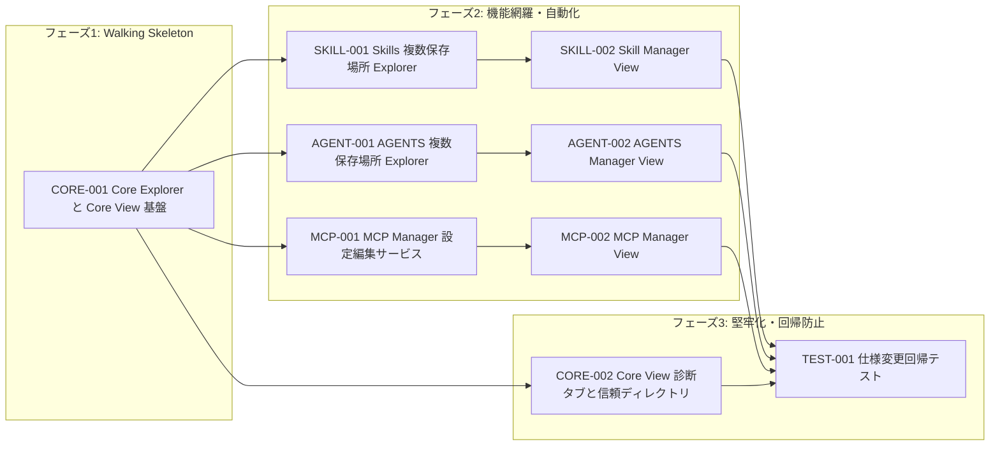

# 🧭 Codex Workspace 仕様変更 実装計画

## 1. 🪜 フェーズ定義

| フェーズ | 目的 | 完了条件 | 代表的な成果物 |
| --- | --- | --- | --- |
| フェーズ1: Walking Skeleton | 既存 Explorer を壊さず、新しい Core View 導線と複数保存場所の基盤を通す | Core View が開き、Core Explorer が `AGENTS.override.md` と不正 `config.toml` の扱いを満たす | Core View シェル、Core Explorer 更新、同期対象追加 |
| フェーズ2: 機能網羅・自動化 | Skills / AGENTS / MCP の Manager View と主要操作を実装する | 変更仕様の管理画面、検索、トグル、追加編集削除が実装される | Skill Manager、AGENTS Manager、MCP Manager |
| フェーズ3: 堅牢化・回帰防止 | 診断タブ、信頼ディレクトリ、Feature Flags、Hooks、テスト網羅を仕上げる | 仕様変更分のユニットテストとビルドが通る | AGENTS Loading Chain、Trusted Directories、Feature Flags、Hooks、回帰テスト |

## 2. 🧾 Issueアウトライン

### IssueID: CORE-001

- タイトル: Codex Core Explorer と Core View 基盤
- フェーズ: Walking Skeleton
- 要件: Codex Core Explore / Codex Core View、config.toml 不正時の扱い、Core同期
- DependsOn: なし
- 規模: 0.5〜1日
- 作業内容
  - Core Explorer に `AGENTS.override.md` を存在時のみ表示する
  - `config.toml` が不正でも Core ファイルを開ける状態判定を追加する
  - 既存履歴ボタンを Core View 起動コマンドへ置き換える
  - Core同期対象に `AGENTS.override.md` を追加する

- AC
  - [ ] [機能] `config.toml`、`AGENTS.md`、存在する `AGENTS.override.md` を Core Explorer に表示できる
  - [ ] [状態/エラー] `config.toml` が TOML として不正でも Core ファイル、Core View、Core Sync は利用できる
  - [ ] [UI/UX] `config.toml` 不正時は Core Explorer 上で警告アイコンまたは警告ツールチップを表示する
  - [ ] [機能] Codex Core View は単一 WebviewPanel として開き、初期タブに会話履歴を表示する
  - [ ] [テスト] Core Explorer、状態判定、Core同期対象の単体テストを更新する

### IssueID: SKILL-001

- タイトル: Skills 複数保存場所 Explorer
- フェーズ: 機能網羅・自動化
- 要件: Skills Explore / 対象保存場所 / 新規ファイル・フォルダ / リネーム / 削除 / フォルダを開く
- DependsOn: CORE-001
- 規模: 0.5〜1日
- 作業内容
  - Project / Workspace / User Skills の保存場所を解決するサービスを追加する
  - Skills Explorer を複数保存場所の単一一覧に変更する
  - Skills の追加、削除、リネーム、フォルダを開く操作を保存場所対応にする
  - 同期は既存どおり Workspace Skills のみを対象に維持する

- AC
  - [ ] [機能] 3種類の Skill 保存場所を優先度順、同一保存場所内は名称昇順で表示できる
  - [ ] [UI/UX] 保存場所種別と絶対パスをアイコンまたはツールチップで識別できる
  - [ ] [機能] 新規ファイル・フォルダ作成時に保存場所を選択でき、未選択時は Workspace Skills が初期候補になる
  - [ ] [状態/エラー] User Skills 削除時に他プロジェクト影響の警告を表示する
  - [ ] [テスト] 保存場所検出、作成先選択、同期対象維持をテストする

### IssueID: SKILL-002

- タイトル: Skill Manager View
- フェーズ: 機能網羅・自動化
- 要件: Skill Manager View / 検索 / 一覧項目 / 有効無効トグル / config.toml 更新
- DependsOn: SKILL-001
- 規模: 0.5〜1日
- 作業内容
  - `SKILL.md` の frontmatter から Skill 名と説明を抽出する
  - Skill Manager View を単一 WebviewPanel として追加する
  - 検索、開く、ON/OFF トグルを実装する
  - `[[skills.config]]` の追加と `enabled` 更新をコメント保持に配慮して実装する

- AC
  - [ ] [機能] Skill名、説明、ファイルパス、有効状態を一覧表示できる
  - [ ] [UI/UX] 検索文字列で Skill名、説明、ファイルパスを部分一致絞り込みできる
  - [ ] [機能] 開く操作で対象 `SKILL.md` をエディタで開ける
  - [ ] [状態/エラー] トグル操作後に `config.toml` と Skills Explorer / Manager View が更新される
  - [ ] [テスト] `[[skills.config]]` の追加、既存 `enabled` 更新、検索をテストする

### IssueID: AGENT-001

- タイトル: AGENTS 複数保存場所 Explorer
- フェーズ: 機能網羅・自動化
- 要件: AGENTS Explore / 対象範囲 / 複数保存場所 / ファイル操作
- DependsOn: CORE-001
- 規模: 0.5〜1日
- 作業内容
  - Project / Workspace / User Agents の保存場所を解決する
  - AGENTS Explorer をサブエージェント `*.toml` 専用の単一一覧に変更する
  - AGENTS Explorer から ON/OFF コンテキストトグルを外し、Manager View 側へ移す
  - 追加、削除、リネーム、フォルダを開くを保存場所対応にする

- AC
  - [ ] [機能] `AGENTS.md` と `AGENTS.override.md` は AGENTS Explorer に表示されない
  - [ ] [機能] 3種類の Agents 保存場所を優先度順、同一保存場所内はファイル名昇順で表示できる
  - [ ] [UI/UX] 保存場所種別と絶対パスをアイコンまたはツールチップで識別できる
  - [ ] [状態/エラー] User Agents 削除時に他プロジェクト影響の警告を表示する
  - [ ] [テスト] 複数保存場所検出、対象除外、保存場所別操作をテストする

### IssueID: AGENT-002

- タイトル: AGENTS Manager View と ON/OFF 管理
- フェーズ: 機能網羅・自動化
- 要件: AGENTS Manager View / 検索 / 一覧項目 / ON/OFF / 復元上書き
- DependsOn: AGENT-001
- 規模: 0.5〜1日
- 作業内容
  - `config.toml` の `[agents.<name>]` と `config_file` 先 TOML から表示情報を組み立てる
  - AGENTS Manager View を単一 WebviewPanel として追加する
  - 検索、開く、ON/OFF トグル、退避復元、同名上書きを実装する
  - トグル後に AGENTS Explorer と Manager View を更新する

- AC
  - [ ] [機能] 名前、説明、モデル、推論の深さ、サンドボックスモード、ON/OFF を一覧表示できる
  - [ ] [UI/UX] 未指定項目は `継承` と表示し、OFF の項目は暗いトーンで表示する
  - [ ] [機能] OFF 操作で `[agents.<name>]` を退避して `config.toml` から削除できる
  - [ ] [機能] ON 操作で退避定義を復元し、同名定義がある場合は退避済み定義で上書きできる
  - [ ] [テスト] OFF、ON、復元上書き、`config_file` 解決をテストする

### IssueID: MCP-001

- タイトル: MCP Manager 設定編集サービス
- フェーズ: 機能網羅・自動化
- 要件: MCP Manager View / 編集項目 / 保存 / 追加 / 削除 / 未対応項目保持
- DependsOn: CORE-001
- 規模: 0.5〜1日
- 作業内容
  - MCP サーバーブロックの読み取り、更新、追加、削除サービスを追加する
  - stdio / http の主要項目をフォーム用モデルへ変換する
  - 保存時バリデーションと未対応項目保持を実装する
  - 既存 MCP Explore の ON/OFF トグル処理を再利用できる形に整える

- AC
  - [ ] [機能] 主要項目を読み取り、stdio / http ごとのフォームモデルへ変換できる
  - [ ] [機能] 保存時に不要な `url` または `command` / `args` を削除できる
  - [ ] [状態/エラー] サーバー名重複、必須項目不足、負数 timeout、tools 同時指定を検証できる
  - [ ] [機能] フォーム未対応項目は保存後も保持される
  - [ ] [テスト] 読み取り、保存、追加、削除、バリデーションをテストする

### IssueID: MCP-002

- タイトル: MCP Manager View
- フェーズ: 機能網羅・自動化
- 要件: MCP Manager View / 検索 / 左右ペイン / 未保存状態 / 即時トグル
- DependsOn: MCP-001
- 規模: 0.5〜1日
- 作業内容
  - MCP Manager View を単一 WebviewPanel として追加する
  - サーバー一覧、検索、追加、削除、編集フォーム、保存、キャンセルを実装する
  - 未保存状態での選択変更、追加、削除の確認フローを実装する
  - ON/OFF トグルを即時保存し、MCP Explorer と Manager View を更新する

- AC
  - [ ] [機能] MCPサーバー名で一覧を絞り込みできる
  - [ ] [UI/UX] 左ペインに一覧と追加削除ボタン、右ペインに編集フォームを表示できる
  - [ ] [状態/エラー] 未保存状態で別操作を行う場合に保存、破棄、キャンセルを選択できる
  - [ ] [機能] 追加は保存ボタンまで `config.toml` に反映しない
  - [ ] [テスト] Webview メッセージ処理、未保存確認、トグル即時保存をテストする

### IssueID: CORE-002

- タイトル: Core View 診断タブと信頼ディレクトリ
- フェーズ: 堅牢化・回帰防止
- 要件: AGENTS Loading Chain / 信頼するディレクトリ / Feature Flags / Hooks / `config.toml` 整理 / タブ Refresh
- DependsOn: CORE-001
- 規模: 0.5〜1日
- 作業内容
  - AGENTS Loading Chain の推定サービスを追加する
  - Core View に AGENTS Loading Chain タブと右ペイン詳細を追加する
  - `[projects."<path>"] trust_level = "trusted"` の一覧、追加、削除を実装する
  - Feature Flags の一覧モデル、ローカライズ、更新処理を追加する
  - Hooks source / entry 診断、warning、source file Open / 作成導線を追加する
  - `config.toml` 整理コマンド、バックアップ、管理対象セクション集約を実装する
  - タブごとの Refresh を実装する

- AC
  - [ ] [機能] ワークスペースルート基準で AGENTS Loading Chain の診断ビューを表示できる
  - [ ] [UI/UX] 状態を色だけでなくバッジ、文字、トーン差で識別できる
  - [ ] [機能] trusted な `[projects."<path>"]` のみを一覧表示できる
  - [ ] [機能] Feature Flags タブで主要 flag の状態確認と更新ができる
  - [ ] [機能] Hooks タブで source ごとの entry と warning を確認できる
  - [ ] [機能] `Codex Workspace: Organize config.toml` で管理対象セクションを先頭出現位置ごとに集約できる
  - [ ] [状態/エラー] 整理コマンド実行時は `.codex/.codex-workspace/config.toml.bk` を更新し、バックアップ失敗時は書き換えを中止する
  - [ ] [状態/エラー] `config.toml` 不正時は信頼ディレクトリの追加削除を無効化し、エラー内容を表示する
  - [ ] [テスト] Loading Chain 判定、信頼ディレクトリ追加削除、Feature Flags、Hooks、`config.toml` 整理、タブ Refresh をテストする

### IssueID: TEST-001

- タイトル: 仕様変更回帰テストと品質確認
- フェーズ: 堅牢化・回帰防止
- 要件: テスト観点全般、Feature Flags / Hooks / `config.toml` 整理回帰、PROMPTS / Template 現行維持
- DependsOn: SKILL-002, AGENT-002, MCP-002, CORE-002
- 規模: 0.5〜1日
- 作業内容
  - 変更仕様の不足テストを追加する
  - Feature Flags と Hooks の回帰テストを追加する
  - `config.toml` 整理とバックアップの回帰テストを追加する
  - PROMPTS Explore と Template Explore に新機能が混入していないことを確認する
  - `npm run compile` と `npm test` を通す
  - セルフチェック結果を整理する

- AC
  - [ ] [テスト] 仕様変更の主要テスト観点が自動テストで検証されている
  - [ ] [機能] PROMPTS Explore と Template Explore の現行仕様が維持されている
  - [ ] [状態/エラー] `config.toml` 不正時の許可操作と無効操作が仕様通りに分離されている
  - [ ] [テスト] `npm run compile` が成功する
  - [ ] [テスト] `npm test` が成功する、または環境依存の失敗理由が明確である

## 3. 🕸️ 依存関係マップ

## 4. 📋 依存一覧

| Issue | DependsOn | 並行可否メモ |
| --- | --- | --- |
| CORE-001 | なし | 最初に実装する基盤 |
| SKILL-001 | CORE-001 | Core の状態判定後に着手 |
| SKILL-002 | SKILL-001 | Skill 検出サービス確定後に着手 |
| AGENT-001 | CORE-001 | Skill 系と並行可能 |
| AGENT-002 | AGENT-001 | Agents 検出サービス確定後に着手 |
| MCP-001 | CORE-001 | Skill / Agents と並行可能 |
| MCP-002 | MCP-001 | MCP 編集サービス確定後に着手 |
| CORE-002 | CORE-001 | Manager 群と並行可能 |
| TEST-001 | SKILL-002, AGENT-002, MCP-002, CORE-002 | 全機能実装後に仕上げ |

## 5. ❓ 要確認事項

- `project` は VS Code ワークスペースの先頭ルートを基準とし、Skills は `project/.agents/skills` を優先、存在しない場合のみ `project/.codex/skills` を読む。
- Project Sub Agents は `project/.codex/agents` を優先、存在しない場合のみ `project/.agents/agents` を読む。
- `workspace` 保存場所は、既存互換のため `$HOME/.codex/skills` と `$HOME/.codex/agents` を指す。
- 仕様内の User Skills は `$HOME/.agents/skills`、User Agents は `$HOME/.codex/agents` として扱う。Workspace Agents と User Agents が同一パスになる場合は同一実体を重複表示しない。
